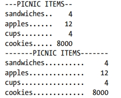

Link to the Pyhton exaples:
- [Examples in Python](https://github.com/cunhapaulo/ReferenceCard/wiki/Python-Examples)

# 1. Index

- [1. Index](#1-index)
- [2. Data Types](#2-data-types)
  - [2.1. **Listas**](#21-listas)
  - [2.2. **Dicionários:** `{'nome': 'John', 'idade': 30, 'cidade': 'Example'}`](#22-dicionários-nome-john-idade-30-cidade-example)
  - [2.3. **Tuplas:** `(1, 'dois', 3.0)`](#23-tuplas-1-dois-30)
- [3. Strings:](#3-strings)
  - [3.1. Text justification with `rjust()`, `ljust()`, and `center()`](#31-text-justification-with-rjust-ljust-and-center)
    - [3.1.1. Program:](#311-program)
- [4. Operators:](#4-operators)
- [5. Flow control statements](#5-flow-control-statements)
  - [5.1. `if` statement:](#51-if-statement)
  - [5.2. `while` statement:](#52-while-statement)
  - [5.3. `for` statement:](#53-for-statement)
- [6. Exception handling:](#6-exception-handling)
- [7. List Comprehension:](#7-list-comprehension)


# 2. Data Types


There are four collection data types in the Python programming language:

|       Nome       |             Exemplo             | Odered | Indexed | Changeable | Duplicates |
| :--------------: | :------------------------------ | :----: | :-----: | :--------: | :--------: |
|       **`List`** | `["a", "b", "c"]`               |  yes   |   yes   |    yes     |    yes     |
| **`Dictionary`** | `{'nome': 'John', 'idade': 30}` |  yes   |   yes   |    yes     |     no     |
|      **`Tuple`** | `(1, 'dois', 3.0)`              |  yes   |   yes   |     no     |    yes     |
|        **`Set`** | `{"apple", "banana", "cherry"}` |   no   |   no    |     no     |     no     |


## 2.1. **Listas** 
   Em Python, as listas são representadas por colchetes (`[]`). Elas são estruturas de dados **mutáveis**, o que significa que você pode modificar, adicionar ou remover elementos. As listas podem conter uma variedade de tipos de dados, incluindo números, strings e até mesmo outras listas.

   Exemplo:
   ```python
   minha_lista = [1, 2, 'três', [4, 5]]
   ```

Algumas das principais funções e métodos disponíveis em Python para trabalhar com listas. Esta lista não é exaustiva, mas abrange muitas das operações comuns. Aqui estão elas:

1. **Funções básicas:**
   - `len(lista)`: Retorna o comprimento da lista.
   - `max(lista)`: Retorna o elemento com o valor máximo na lista.
   - `min(lista)`: Retorna o elemento com o valor mínimo na lista.
   - `sum(lista)`: Retorna a soma de todos os elementos da lista.

2. **Métodos de modificação:**
   - `lista.append(elemento)`: Adiciona um elemento ao final da lista.
   - `lista.extend(iterável)`: Adiciona os elementos do iterável ao final da lista.
   - `lista.insert(posição, elemento)`: Insere um elemento em uma posição específica.
   - `lista.remove(elemento)`: Remove a primeira ocorrência do elemento na lista.
   - `lista.pop([índice])`: Remove e retorna o elemento na posição especificada (ou o último, se nenhum índice for fornecido).
   - `lista.clear()`: Remove todos os elementos da lista.

3. **Métodos de pesquisa:**
   - `lista.index(elemento)`: Retorna o índice da primeira ocorrência do elemento.
   - `elemento in lista`: Retorna `True` se o elemento estiver na lista, caso contrário, `False`.
   - `lista.count(elemento)`: Retorna o número de ocorrências do elemento na lista.

4. **Métodos de ordenação:**
   - `lista.sort()`: Ordena os elementos da lista in-place.
   - `lista.sort(key=str.lower)`: Ordena minúsculas primeiro.
   - `sorted(lista)`: Retorna uma nova lista ordenada, sem modificar a original.

5. **Métodos de cópia:**
   - `nova_lista = lista.copy()`: Cria uma cópia rasa da lista.
   - `nova_lista = list(lista)`: Cria uma nova lista com os mesmos elementos.

6. **Métodos de fatiamento e manipulação:**
   - `lista[start:stop]`: Retorna uma sublista a partir do índice `start` até `stop-1`.
   - `lista[start:stop:step]`: Retorna uma sublista com um passo específico.

Estas são apenas algumas das funções e métodos disponíveis para listas em Python. A linguagem é rica em recursos, permitindo uma manipulação versátil de estruturas de dados. Se precisar de mais detalhes sobre algum método específico ou tiver outras dúvidas, fique à vontade para perguntar!


## 2.2. **Dicionários:** `{'nome': 'John', 'idade': 30, 'cidade': 'Example'}`
   Dicionários em Python são representados por chaves (`{}`). Eles são estruturas de dados que armazenam pares chave-valor, permitindo que você associe um valor a uma chave específica. Dicionários são úteis para mapear informações de forma eficiente.

   Exemplo:
   ```python
   meu_dicionario = {'nome': 'John', 'idade': 30, 'cidade': 'Example'}
   ```

Algumas das principais funções e métodos disponíveis em Python para trabalhar com dicionários. Aqui estão elas:

1. **Operações básicas:**
   - `len(dicionario)`: Retorna o número de itens no dicionário.
   - `chave in dicionario`: Retorna `True` se a chave estiver presente no dicionário, caso contrário, `False`.
   - `dicionario.keys()`: Retorna uma lista de todas as chaves no dicionário.
   - `dicionario.values()`: Retorna uma lista de todos os valores no dicionário.
   - `dicionario.items()`: Retorna uma lista de tuplas (chave, valor) para cada item no dicionário.

2. **Métodos de modificação:**
   - `dicionario[chave] = valor`: Adiciona ou atualiza um item no dicionário.
   - `dicionario.update(dicionario2)`: Adiciona os itens de `dicionario2` ao dicionário.
   - `dicionario.pop(chave)`: Remove e retorna o valor associado à chave.
   - `dicionario.popitem()`: Remove e retorna o último par chave-valor inserido.
   - `dicionario.clear()`: Remove todos os itens do dicionário.

3. **Acesso seguro a valores:**
   - `dicionario.get(chave)`: Retorna o valor associado à chave, ou `None` se a chave não existir.
   - `dicionario.setdefault(chave, valor_padrao)`: Retorna o valor associado à chave, adicionando a chave com um valor padrão se não existir.

4. **Cópias e Views:**
   - `novo_dicionario = dicionario.copy()`: Cria uma cópia rasa do dicionário.
   - `nova_view_chaves = dicionario.keys()`: Retorna uma visão (view) das chaves no dicionário.
   - `nova_view_valores = dicionario.values()`: Retorna uma visão dos valores no dicionário.
   - `nova_view_itens = dicionario.items()`: Retorna uma visão dos pares chave-valor no dicionário.

Estas são apenas algumas das funções e métodos disponíveis para dicionários em Python. A linguagem oferece uma ampla gama de funcionalidades para manipulação eficiente de dicionários. Se precisar de mais detalhes sobre algum método específico ou tiver outras dúvidas, sinta-se à vontade para perguntar!


```Python
import os
from pprint import pprint

def main():
    
    os.system("cls")
    
    my_dict = {"Paulo" : {'a','b','c'}, "Mara" : {'d','e','f'}, "Família" : {'Paulo','Mara','Gabriel', 'Felipe'}}
     
    print("my_dict")
    print(my_dict)
    print("\n")
    # RESULT:
    #
    # my_dict
    # {'Paulo': {'b', 'a', 'c'}, 'Mara': {'d', 'f', 'e'}, 'Família': {'Felipe', 'Gabriel', 'Paulo', 'Mara'}}
    
    print("Add member to Dictionary")
    my_dict["Felipe"] = {'x', 'y', 'z'}
    print("my_dict['Felipe'] = {'x', 'y', 'z'}")
    print(my_dict)
    print("\n")
    # RESULT
    #
    #Add member to Dictionary
    # my_dict['Felipe'] = {'x', 'y', 'z'}
    # {'Paulo': {'b', 'c', 'a'}, 'Mara': {'d', 'e', 'f'}, 'Família': {'Mara', 'Paulo', 'Gabriel', 'Felipe'}, 'Felipe': {'y', 'z', 'x'}}
    
        
    keys = my_dict.keys()
    print("my_dict.keys()")
    print(keys)
    print("\n")
    # RESULT:
    #
    # my_dict.keys()
    # dict_keys(['Paulo', 'Mara', 'Família'])
    
    values = my_dict.values()
    print("my_dict.values()")
    print(values)
    print("\n")
    # RESULT:
    #
    # my_dict.values()
    # dict_values([{'b', 'a', 'c'}, {'d', 'f', 'e'}, {'Felipe', 'Gabriel', 'Paulo', 'Mara'}])
    
    items = my_dict.items()
    print("my_dict.items()")
    print(items)
    print("\n")
    # RESULT:
    #
    # my_dict.items()
    # dict_items([('Paulo', {'b', 'a', 'c'}), ('Mara', {'d', 'f', 'e'}), ('Família', {'Felipe', 'Gabriel', 'Paulo', 'Mara'})])
    
    print("Individual items (tuples):")
    for v in items:
        print(v)
    print("\n")
    # RESULT:
    #
    # Individual items (tuples):
    # ('Paulo', {'b', 'c', 'a'})
    # ('Mara', {'d', 'e', 'f'})
    # ('Família', {'Felipe', 'Gabriel', 'Paulo', 'Mara'})
    
    print("Individual elements in the items (tuples):")
    for v in items:
        name, letter = v
        print(name)
        print(letter)
    print("\n")
    # RESULT:
    #
    # Individual elements in the items (tuples):
    # Paulo
    # {'b', 'c', 'a'}
    # Mara
    # {'d', 'e', 'f'}
    # Família
    # {'Felipe', 'Gabriel', 'Paulo', 'Mara'}

    print("Individual elements in the list of items:")
    for n in items:
        name, letter = n # tuple dissociation
        print(name)
        for l in letter:
            print(l)
        print("")
    # RESULT:
    #
    # Individual elements in the list of items:
    # Paulo
    # b
    # c
    # a
    #
    # Mara
    # d
    # e
    # f        
    #
    # Família
    # Felipe
    # Gabriel
    # Paulo
    # Mara
    
    print("len(my_dict)")
    size = len(my_dict)
    print(size)
    print("")  
        

if __name__ == "__main__":
    # calls the main function
    main()

```

##  2.3. **Tuplas:** `(1, 'dois', 3.0)`
   As tuplas são representadas por parênteses (`()`). Ao contrário das listas, **as tuplas são imutáveis**, ou seja, após criadas, seus elementos não podem ser alterados. Elas são geralmente utilizadas para armazenar coleções de dados relacionados.

   Exemplo:
   ```python
   minha_tupla = (1, 'dois', 3.0)
   ```

Olá [User], vou listar exaustivamente algumas das principais funções e operações disponíveis em Python para trabalhar com tuplas. Assim como com as listas, esta lista não é exaustiva, mas abrange muitas das operações comuns. Aqui estão elas:

1. **Funções básicas:**
   - `len(tupla)`: Retorna o número de elementos na tupla.
   - `max(tupla)`: Retorna o elemento com o valor máximo na tupla.
   - `min(tupla)`: Retorna o elemento com o valor mínimo na tupla.
   - `sum(tupla)`: Retorna a soma de todos os elementos da tupla.

2. **Operações básicas:**
   - `tupla1 + tupla2`: Concatenação de tuplas.
   - `tupla * n`: Repete a tupla `n` vezes.

3. **Operações de pesquisa:**
   - `elemento in tupla`: Retorna `True` se o elemento estiver na tupla, caso contrário, `False`.
   - `tupla.index(elemento)`: Retorna o índice da primeira ocorrência do elemento.

4. **Desempacotamento de tupla:**
   - `(var1, var2, var3) = tupla`: Desempacota os elementos da tupla nas variáveis correspondentes.

5. **Métodos de contagem:**
   - `tupla.count(elemento)`: Retorna o número de ocorrências do elemento na tupla.

6. **Slicing (fatiamento):**
   - `tupla[start:stop]`: Retorna uma sub-tupla a partir do índice `start` até `stop-1`.
   - `tupla[start:stop:step]`: Retorna uma sub-tupla com um passo específico.

7. **Função `tuple()`:**
   - `nova_tupla = tuple(iterável)`: Converte um iterável (lista, string, etc.) em uma tupla.

Tuplas em Python **são imutáveis**, então as operações que modificam a estrutura da tupla, como adição ou remoção de elementos, não estão disponíveis. No entanto, as operações de pesquisa e manipulação de elementos são similares às das listas.

Se precisar de mais detalhes sobre algum método específico ou tiver outras dúvidas, fique à vontade para perguntar!


# 3. Strings:

```python
    myName = input()
    nameLength = len(myName)  length of a string
    print("Seu nome é " + myName + " que tem " + str(nameLength) + " caracteres."

     str(54), int('54'), float('54.0')
```

ou

```Python
>>> name = 'Al'
>>> age = 4000
>>> f'My name is {name}. Next year I will be {age + 1}.'
'My name is Al. Next year I will be 4001.'
```
ou

```Python
print("Meu nome é {0}, nasci no ano de {1}. Portanto, 
       tenho {2} anos de idade.".format("Paulo", 1969, 54))
```

- Result:
```
Meu nome é Paulo, nasci no ano de 1969. Portanto, tenho 54 anos de idade.
```

## 3.1. Text justification with `rjust()`, `ljust()`, and `center()`

```python
>>> "[Página Inicial]".center(80)
'                                [Página Inicial]                                '

>>> "[Página Inicial]".center(80, "=")
'================================[Página Inicial]================================'

>>> "[Página Inicial]".ljust(80, "=")
'[Página Inicial]================================================================'

>>> "[Página Inicial]".rjust(80, "=")
'================================================================[Página Inicial]'
```

### 3.1.1. Program:

```Python
def printPicnic(itemsDict, leftWidth, rightWidth):
    print('PICNIC ITEMS'.center(leftWidth + rightWidth, '-'))
    for k, v in itemsDict.items():
        print(k.ljust(leftWidth, '.') + str(v).rjust(rightWidth))

picnicItems = {'sandwiches': 4, 'apples': 12, 'cups': 4, 'cookies': 8000}
printPicnic(picnicItems, 12, 5)
printPicnic(picnicItems, 20, 6)
```

- Result:
  



# 4. Operators:

|  Op   |     Description     |
| :---: | :------------------ |
|  ==   | equal to            |
|  !=   | not equal to        |
|   <   | lower than          |
|   >   | greater than        |
|  <=   | lower or equal to   |
|  >=   | greater or equal to |
| True  | true                |
| False | false               |
|  not  | not                 |
|  and  | and                 |
|  or   | or                  |

# 5. Flow control statements

## 5.1. `if` statement:

```python
# If statement
if name == 'Alice':
    print('Hi, Alice.')


# If Else statement:
if name == 'Alice':
    print('Hi, Alice.')
else:
    print('Hello, stranger.')


# Elif statement:
if name == 'Alice':
    print('Hi, Alice.')
elif age < 12:
    print('You are not Alice, kiddo.')
elif age > 100:
    print('You are not Alice, grannie.')
elif age > 2000:
    print('Unlike you, Alice is not an undead, immortal vampire.')
else:
    print('You are neither Alice nor a little kid.')
```

## 5.2. `while` statement:

```python
# While loop statement
while True:
    print("Please, type you name.")
    name = input()
    if name != "Billy":
        continue
    print(Welcome back, Billy. Type your password")
    password = input()
    if password == "swordfish":
        break
print("Access granted.")

```

```python
name = ''
while not name:
    print('Enter your name:')
    name = input()
print('How many guests will you have?')
numOfGuests = int(input())
if numOfGuests:
    print('Be sure to have enough room for all your guests.')
print('Done')
```

## 5.3. `for` statement:

**Observation**: `break` and `continue` allowed.

```python

print('My name is')
for i in range(5):
    print('Jimmy Five Times (' + str(i) + ')')

for i in range(0, 10, 2):  # 0 - start; 10 - end; 2 - step
    print(i)

for i in range(5, -1, -1):
    print(i)
```


# 6. Exception handling:

```python
import time, sys

indent = 0 # How many spaces to indent.
indentIncreasing = True # Whether the indentation is increasing or not.

try:
    while True: # The main program loop.
        print(' ' * indent, end='')
        print('********')
        time.sleep(0.1) # Pause for 1/10 of a second.

        if indentIncreasing:
            # Increase the number of spaces:
            indent = indent + 1
            if indent == 10:
                # Change direction:
                indentIncreasing = False
        else:
            # Decrease the number of spaces:
            indent = indent - 1
            if indent == 0:
                # Change direction:
                indentIncreasing = True

except KeyboardInterrupt:
    sys.exit()
```

# 7. List Comprehension:

## Syntax:
```Python
    lst_instance = list(range(1,10))
    lst_tuple_squares = [ (x, x**2) for x in lst_instance]
    lst_even_squares  = [ x**2      for x in lst_instance if x%2 == 0]
    lst_squares       = [ ]
 
    # Execution:
    # >>> lst_squares
    # [(1, 1), (2, 4), (3, 9), (4, 16), (5, 25)]
    # >>> lst_even_squares
    # [4, 16]

```

## Example:

```Python
>>> list_instance = [('nome', 1), ('idade', 2), ('endereço', 3)]
>>> l = [(y,x) for (x,y) in list_instance]
>>> l
[(1, 'nome'), (2, 'idade'), (3, 'endereço')]
```

## Program:

```Python
    file_info = [
        ("Usuário do programa", os.getlogin()),
        # ("Nome do arquivo",     reader.getDocumentInfo),
        ("Nome do arquivo",     os.path.basename(file_path)),
        ("Número de páginas",   document_page_number),
        ("PDF Creator",         metadata_info.creator),
        ("PDF Producer",        metadata_info.producer),
    ]

    # List comprehension
    [print((str(x)+':').ljust(25,'.') + str(y)) for (x, y) in file_info]
```
